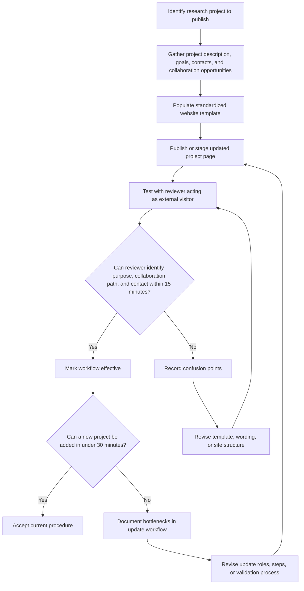
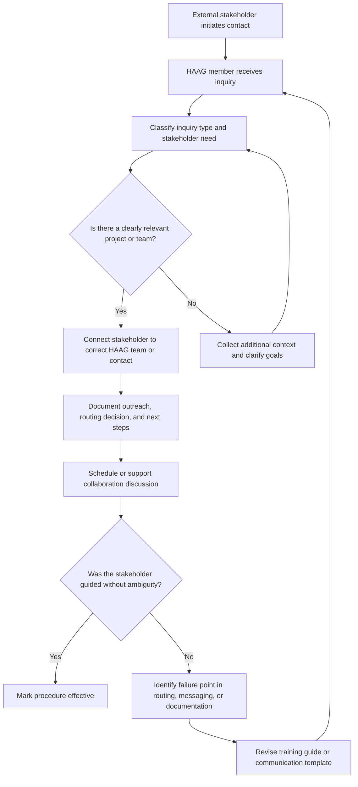

# HAAG Engagement Initiative — Initiative Questions

**Title:** HAAG Engagement Initiative: Stakeholder Collaboration System

This document is based on the HAAG Engagement Initiative overview and workstreams provided by the user. It focuses on how HAAG can create repeatable, testable procedures for external engagement through both website-facing and people-facing processes.

## Describe your initiative / Procedure.

The HAAG Engagement Initiative is an organizational initiative designed to make external collaboration with HAAG more structured, repeatable, and sustainable. Rather than focusing on the internal execution of any one research project, the initiative focuses on the systems that allow outside stakeholders to discover HAAG, understand what HAAG is working on, and connect with the right people in an efficient way.

The procedure currently has two connected workstreams. The first is the **Website Engagement Workstream**, which is concerned with how HAAG research is represented online, how project information is kept current, and how outside visitors can identify collaboration opportunities and contact points. The second is the **Stakeholder Engagement Workstream**, which is concerned with how HAAG members respond to outside interest, route inquiries to the right teams, document communication, and support the early stages of collaboration.

In practice, the initiative is building a system with the following sequence: a stakeholder discovers HAAG, reviews website information, identifies a relevant research area or contact, initiates communication, and is then guided by a HAAG member into the appropriate collaboration pathway. To support this, the initiative is producing reusable procedures, templates, training materials, and workflows that can be handed off across semesters.

## Explain the hypotheses / KPIs you have measured at this time and what is left to be measured.

At this stage, the main hypotheses and KPIs are drawn directly from the initiative’s evaluation criteria and can be divided into website performance, stakeholder facilitation performance, and sustainability of process execution.

The first hypothesis is that a standardized website structure will make HAAG research easier for external audiences to understand and act on. The key KPIs for this hypothesis are the time required to add a new research project to the website, the time required for an external visitor to identify the project purpose, collaboration opportunities, and appropriate contact person, and whether website updates can be completed without undocumented steps. The initiative documentation defines target thresholds of under 30 minutes to add a new project and under 15 minutes for a visitor to identify key collaboration information.

The second hypothesis is that a documented stakeholder engagement procedure will reduce ambiguity when handling external collaboration inquiries. The KPIs for this hypothesis include whether a HAAG member unfamiliar with the process can follow the workflow without extra guidance, whether collaboration requests are consistently routed to the correct team, and whether communication is being documented in a repeatable way. These indicators are partially measurable now through pilot use of drafts and informal observation, but they still need more formal testing with multiple users.

The third hypothesis is that training and documentation will improve continuity across semesters. The KPI here is whether another HAAG member can independently execute the process using the hosted documents alone. That has not yet been fully measured. What remains to be measured includes formal usability testing, stakeholder satisfaction, response time consistency, update accuracy over time, and long-term retention of process knowledge after handoff.

## Explain your method for testing these hypotheses via flowcharts.

The hypotheses are being tested by converting the initiative into explicit workflows and then checking whether users can complete those workflows efficiently and correctly. This means the flowcharts are not just visual summaries. They are operational tests. If a user gets stuck at a decision point, requires undocumented help, or cannot produce the expected output, that is evidence that the process still needs revision.

### Flowchart 1: Website Engagement Testing Flow

This flowchart tests whether the website procedure produces pages that are fast to create and easy for outsiders to understand. It also tests whether update bottlenecks come from missing inputs, poor template design, or unclear ownership.

### Flowchart 2: Stakeholder Engagement Testing Flow

This flowchart tests whether HAAG members can consistently triage external interest, connect people to the right project, and document the process without relying on hidden institutional knowledge.

## Explain how stakeholders are engaging with your initiative. Reflect on whether their engagement matches your expectations and what changes may be necessary given the behavior that you observed.

Stakeholders in this initiative include HAAG administrators, research managers, engagement facilitators, faculty advisors, external collaborators, and prospective contributors. Their engagement is currently strongest at the internal planning level, where HAAG members are defining procedures, expected roles, and documentation artifacts. External engagement appears to be more of a target state than a fully mature system at this point, which is consistent with the initiative still being in a design and testing phase.

This partially matches expectations. It is reasonable that internal stakeholders are more engaged early because the initiative is fundamentally about building process infrastructure. However, if external stakeholders are not yet interacting with the system in a structured way, then additional pilot testing is needed. That may require more visible website prompts, clearer collaboration language, and a defined intake point so that real stakeholder behavior can be observed rather than assumed.

Based on this pattern, the initiative may need to prioritize lightweight pilot deployment over further abstract planning. In other words, even an imperfect intake workflow should be tested with real or simulated users so the team can observe where people hesitate, what information they seek first, and which parts of the collaboration pathway remain too implicit.

## What processes have you documented or begun documenting to ensure the sustainability of your initiative? Provide where you are hosting this procedure. What additional documentation do you plan to complete? Link documents here for review.

The initiative has already identified a clear set of sustainability-oriented documents. These include the Website Engagement Procedure Document, Research Project Website Template, Website Update Workflow Guide, Website Engagement Best Practices Guide, Stakeholder Engagement Procedure Document, Stakeholder Engagement Training Guide, External Collaboration Facilitation Workflow, and Collaboration Communication Templates.

## How are you currently measuring progress toward your goals? What indicators of success or challenges have you identified so far?

Progress is currently being measured through completion of core artifacts and through alignment with the initiative’s evaluation criteria. In the near term, progress means whether the initiative has converted broad goals into actionable documentation, clear workflows, and testable procedures. This is appropriate because the initiative is building organizational infrastructure first. fileciteturn0file0L25-L49

Current indicators of success include increased clarity around what the website should communicate, clearer definitions of how collaboration requests should be handled, and a growing set of deliverables that can eventually support training and handoff. Current indicators of challenge include the fact that some success criteria still depend on user testing that may not yet have happened, and the possibility that too much of the process still lives in assumptions rather than demonstrated execution.

A useful framing is that documentation completion is an early progress indicator, but process usability and stakeholder response are the more meaningful later-stage indicators. The initiative appears to be moving from the first stage toward the second.

## What obstacles or bottlenecks have you encountered in implementing your initiative? Which anticipated challenges have materialized, and what unexpected issues have arisen?

A major anticipated challenge is ambiguity in ownership. Because the initiative spans website content, communication workflows, and stakeholder routing, it can be unclear who is responsible for updates, who validates content, and who should respond first to incoming collaboration requests. The source document itself highlights the need to define responsible roles, update frequency, and verification steps, which suggests this is already recognized as a risk. 

A second anticipated bottleneck is the risk of outdated information. The website workstream explicitly calls for analysis of where information becomes outdated and how website information is synchronized with research repositories. That means information drift has likely already been observed or is expected to be a serious issue. 

An additional likely issue is that external stakeholder journeys may not match internal assumptions. For example, stakeholders may not know the language HAAG uses for projects, may not understand which opportunities are open for collaboration, or may reach out through channels that are not yet integrated into the workflow. These are the kinds of unexpected issues that often arise once a process is piloted with real users.

Overall, the main bottlenecks appear to be process clarity, ownership clarity, documentation completeness, and the gap between designed workflows and actual stakeholder behavior.
