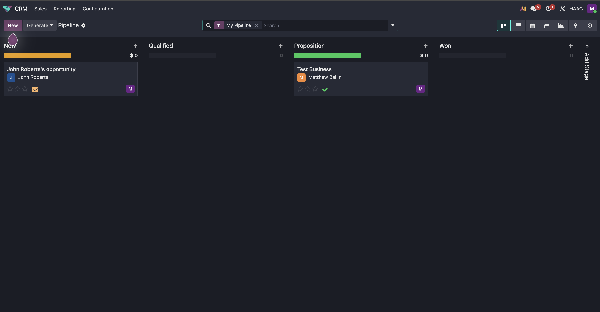

# HAAG Engagement Initiative

### Stakeholder Collaboration System

---

# Overview

This repository contains documentation, frameworks, and procedures developed as part of the **HAAG Engagement Initiative**.

The purpose of this initiative is to design and test **organizational processes that enable external stakeholders to effectively engage with HAAG research activities**.

This initiative operates at the **organizational level** rather than at the level of individual research projects.

The initiative focuses on two core engagement mechanisms:

1. **Website Engagement** — how HAAG communicates research opportunities and collaboration pathways through its website.
2. **Stakeholder Engagement** — how HAAG members facilitate collaboration between HAAG and external partners using communication channels appropriate to the stakeholder and context, whether email or other formats, with communication activity tracked in a CRM.

The objective is to produce **repeatable procedures, documentation, and training artifacts** that allow HAAG members to consistently support external collaboration.

---

# Initiative Goals

The initiative aims to answer two core questions:

1. **How should the HAAG website be used to engage external audiences?**

2. **How should HAAG members facilitate collaboration between HAAG and external stakeholders?**

To address these questions, this initiative develops documented procedures and evaluates their effectiveness through structured testing.

---

# Engagement Workstreams

The initiative is organized into two engagement workstreams.

---

# 1. Website Engagement Workstream

## Objective

Design procedures that allow the HAAG website to function as an effective interface between HAAG research and external stakeholders.

The website should enable external users to:

* discover HAAG research activities
* understand collaboration opportunities
* identify relevant contacts
* initiate collaboration discussions

---

## Action Items

1. **Document Current Website Structure**

   Analyze the existing HAAG website and document:

   * current research project listings
   * available collaboration information
   * current update workflows
   * points where information becomes outdated

---

2. **Define Website Engagement Procedure**

   Create a documented procedure describing:

   * how research projects should appear on the website
   * how project pages are updated
   * how external collaborators initiate contact
   * how website information is synchronized with research repositories

---

3. **Design Website Content Template**

   Develop a standardized template for presenting research projects that includes:

   * project description
   * research objectives
   * collaboration opportunities
   * contact information
   * links to supporting resources

---

4. **Create Website Update Workflow**

   Define a workflow specifying:

   * who updates website content
   * how updates are requested
   * how outdated content is identified
   * how updates are validated

---

## Deliverables

The Website Engagement workstream will produce the following artifacts:

* **Website Engagement Procedure Document**
* **Research Project Website Template**
* **Website Update Workflow Guide**
* **Website Engagement Best Practices Guide**

---

## Evaluation Criteria

The website engagement system will be considered adequate if:

1. A new HAAG research project can be added to the website using the provided template in **under 30 minutes**.

2. An external visitor can identify:

   * the project purpose
   * collaboration opportunities
   * the appropriate contact person

   within **15 minutes of visiting the page**.

3. The website update workflow clearly defines:

   * responsible roles
   * update frequency
   * verification steps.

4. The procedures can be followed without requiring additional undocumented steps.

---

# 2. Stakeholder Engagement Workstream

## Objective

Develop procedures that enable HAAG members to facilitate collaboration between HAAG and external partners.

Stakeholders may include:

* industry partners
* academic collaborators
* external research labs
* prospective contributors

The goal is to create structured processes for initiating and managing collaboration. These processes should be communication-style agnostic, allowing HAAG members and stakeholders to engage through email or other appropriate communication methods depending on context, while ensuring that communication activity is consistently tracked in a CRM.

---

## Action Items

1. **Map Current Stakeholder Interaction Process**

   Document how collaborations currently begin, including:

   * how partners discover HAAG
   * how communication is initiated across channel-agnostic formats such as email or other appropriate communication methods
   * how research discussions begin

---

2. **Define Stakeholder Engagement Procedure**

   Create a documented procedure that explains how HAAG members should:

   * respond to collaboration inquiries through the communication channel most appropriate to the stakeholder and context
   * introduce external partners to HAAG research using email or other suitable communication methods
   * connect partners with appropriate research teams
   * record and track stakeholder communication in a CRM

---

3. **Develop Stakeholder Engagement Training Guide**

   Create training materials for HAAG members who may act as engagement facilitators.

   The guide should cover:

   * how to communicate HAAG research goals
   * how to identify collaboration opportunities
   * how to introduce external partners to research teams
   * how to select the appropriate communication method for the stakeholder and context
   * how to log communication activity in the CRM

---

4. **Create Collaboration Facilitation Workflow**

   Define a workflow describing:

   * how collaboration requests are handled
   * how external partners are matched with projects
   * how collaboration discussions are documented
   * how stakeholder communication is logged and tracked in a CRM regardless of whether the interaction occurs by email or another communication method

---

## Deliverables

The Stakeholder Engagement workstream will produce:

* **Stakeholder Engagement Procedure Document**
* **Stakeholder Engagement Training Guide**
* **External Collaboration Facilitation Workflow**
* **Collaboration Communication Templates**
* **CRM Communication Tracking Guidelines**

---

## Evaluation Criteria

The stakeholder engagement system will be considered adequate if:

1. A HAAG member unfamiliar with the process can follow the engagement procedure without additional guidance.

2. The training guide clearly explains:

   * how to identify relevant research groups
   * how to introduce external collaborators
   * how to initiate collaboration discussions through appropriate communication channels.

3. The collaboration facilitation workflow specifies:

   * who responds to inquiries
   * how partners are connected to projects
   * how communication is documented and tracked in a CRM.

4. External stakeholders receive clear guidance on how to initiate collaboration.

---

# Reporting and Evaluation

The initiative will produce a final report summarizing:

* the procedures developed
* observations during testing
* recommended improvements

The report will evaluate whether the engagement procedures:

* reduce ambiguity in external collaboration
* improve visibility of HAAG research activities
* create repeatable processes for engagement.

---

# Intended Audience

The outputs of this initiative are intended for:

* HAAG administrators
* research managers
* engagement facilitators
* faculty advisors
* external collaborators.

---

# Long-Term Impact

If successful, the engagement framework will allow HAAG to:

* support sustainable external collaboration
* improve visibility of HAAG research activities
* standardize engagement practices across semesters
* reduce ambiguity in collaboration initiation
* maintain more consistent records of stakeholder communication through CRM tracking.
